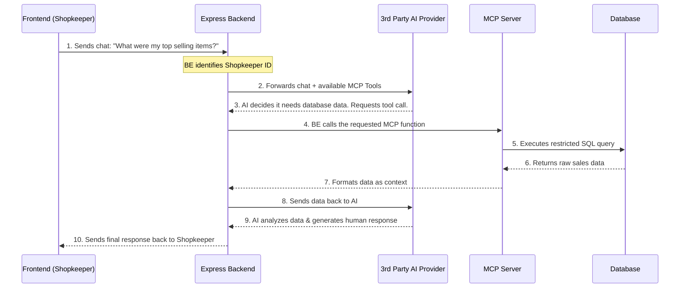

Imagine you run a large e-commerce platform. You want to give your shopkeepers a "smart assistant" to help them analyze their sales, check inventory, and manage their store. Instead of building hundreds of custom dashboards, you decide to use AI.

However, AI models don't naturally know what's in your database. This is where **Model Context Protocol (MCP)** comes in. MCP acts as a secure bridge, letting the AI talk to your specific database or internal APIs safely.

In this tutorial, we will build an MCP server from scratch inside a Node.js Express application. We'll explore the flow of data, compare AI providers, and crucially, see how to prevent one shopkeeper from accidentally (or maliciously) reading another shopkeeper's data.

---

## The Request Flow

Here is exactly what happens when a shopkeeper asks the AI a question, like "What were my top selling items yesterday?":



---

## MCP Setup Methods: Local vs. HTTP

When integrating an MCP server with your backend, you generally have two choices for how they communicate.

### 1. Standard Input/Output (stdio)
In this setup, your backend spawns the MCP server as a child process. They communicate by writing to `stdin` and reading from `stdout`.

*   **Pros:** Very easy to secure. The MCP server runs locally inside the backend environment and isn't exposed to the internet at all.
*   **Cons:** Harder to scale independently. If your Express backend scales horizontally (multiple instances), each instance runs its own MCP child process.

### 2. Server-Sent Events (SSE) over HTTP
In this setup, the MCP server runs as its own standalone web service. The client (your backend) connects to it via HTTP.

*   **Pros:** Highly scalable. You can run one massive cluster of MCP servers that handles requests from many different backend services.
*   **Cons:** Requires more network overhead. You also have to implement strict authentication (like API keys or JWTs) to ensure only your backend can talk to the MCP server.

For an embedded Express setup, **stdio** is usually the simplest starting point.

---

## Choosing an AI Provider

To power the assistant, your backend needs to connect to a Large Language Model (LLM). Here are some top choices, focusing on cost and capabilities:

| Provider | Notable Models | Pros | Cons | Free Tier / Pricing |
| :--- | :--- | :--- | :--- | :--- |
| **Google Gemini** | Gemini 1.5 Flash, Gemini 1.5 Pro | Deep integration with Google tools, massive context window (up to 2M tokens). | Sometimes stricter safety filters can cause false refusals. | **Generous free tier** available via Google AI Studio. Excellent for dev/testing. |
| **OpenAI** | GPT-4o, GPT-3.5 | Industry standard, incredibly smart, highly reliable tool-calling capabilities. | Ecosystem lock-in, can get expensive at scale. | Very limited free credits. You pay per 1k tokens used. |
| **Anthropic** | Claude 3.5 Sonnet, Opus | Arguably the best at following complex logic and formatting. Created the MCP standard. | Less widespread community tooling compared to OpenAI. | Paid API. You pay per 1M tokens used. No true "free tier" for API. |

**Recommendation:** Start with **Google Gemini (Flash)** for development because of its free tier. For production, **Claude 3.5 Sonnet** is currently the gold standard for tool-calling and MCP integration.

---

## Securing Shopkeeper Data (The Golden Rule)

The biggest risk in our e-commerce app is **data leakage**. If Shopkeeper A asks "What are the latest orders?", the AI must *only* see Shopkeeper A's orders. If the MCP simply runs `SELECT * FROM orders`, Shopkeeper A will see Shopkeeper B's data!

We must apply a generic concept: **Contextual Filtering**. Every database query must have a `WHERE shopkeeper_id = X` restriction.

There are two main ways to enforce this.

### Method 1: Backend Enforced (Recommended)

In this approach, the Express backend is the source of truth. It authenticates the user, extracts their ID, and explicitly injects it into the MCP tool call. The AI never even knows other shopkeepers exist.

**Express Backend Code:**
```javascript
// Express route handling the chat
app.post('/api/chat', async (req, res) => {
    // 1. Authenticate user from session/token
    const currentShopkeeperId = req.user.shopkeeperId;
    const userPrompt = req.body.message;

    // 2. We define the tool for the AI. Notice we DON'T ask the AI for the shopkeeper ID.
    const tools = [{
        name: "get_sales_data",
        description: "Fetch sales data for the current user's shop.",
        parameters: { type: "object", properties: {} } // No inputs required from AI!
    }];

    // 3. AI decides to use the tool...
    // 4. We execute the tool, injecting the ID ourselves
    const result = await executeMcpTool("get_sales_data", {
        shopkeeperId: currentShopkeeperId // Injected by backend, trusted.
    });

    // ... return result to AI ...
});
```

**MCP Server Code:**
```javascript
// Inside the MCP Server
mcp.addTool("get_sales_data", async (params) => {
    // We trust the 'shopkeeperId' passed by our secure backend
    const { shopkeeperId } = params;

    // SQL syntax demo
    const query = `
        SELECT item_name, amount, created_at
        FROM orders
        WHERE shopkeeper_id = $1
        ORDER BY created_at DESC
        LIMIT 10;
    `;

    const dbResult = await db.query(query, [shopkeeperId]);
    return JSON.stringify(dbResult.rows);
});
```

### Method 2: MCP Server Validation

If your MCP server is decoupled (e.g., using SSE over HTTP), you might prefer the MCP server to validate requests itself using an authorization token.

**Express Backend Code:**
```javascript
app.post('/api/chat', async (req, res) => {
    // Pass the raw auth token to the AI's tool request
    const userToken = req.headers.authorization;

    // ... AI decides to use tool ...
    const result = await callExternalMcpServer("get_sales_data", {}, userToken);
});
```

**MCP Server Code:**
```javascript
// Inside the HTTP-based MCP Server
mcp.addTool("get_sales_data", async (params, context) => {
    // 1. MCP Server receives the token from the connection context
    const token = context.headers.authorization;

    // 2. Validate token and extract ID
    const decoded = jwt.verify(token, process.env.JWT_SECRET);
    const shopkeeperId = decoded.shopkeeperId;

    if (!shopkeeperId) throw new Error("Unauthorized");

    // 3. Execute restricted query
    const query = `
        SELECT item_name, amount
        FROM orders
        WHERE shopkeeper_id = $1;
    `;

    const dbResult = await db.query(query, [shopkeeperId]);
    return JSON.stringify(dbResult.rows);
});
```

---

## Cost and Complexity Analysis

Building this feature is an investment. Here is what you need to consider:

### Complexity
*   **Low to Medium:** Using the *Backend Enforced* method with a *stdio* local MCP server is relatively straightforward. You only have to write a few extra functions in your existing Express app.
*   **High:** Building a standalone HTTP SSE MCP server with internal token validation requires managing a new microservice, handling networking, setting up CI/CD, and managing strict internal API security.

### Price (Operational Costs)
*   **Hosting:** If using *stdio* local MCP, hosting costs are essentially $0 (it piggybacks on your existing backend server's CPU/RAM). Standalone HTTP MCP servers will require separate hosting (e.g., AWS ECS, Vercel, or Heroku), adding monthly fixed costs.
*   **AI API Tokens:** This is the real variable cost. Every time a user chats, you pay for:
    1.  The user's prompt (Input Tokens).
    2.  The database data returned by the MCP server (Input Context Tokens).
    3.  The AI's final answer (Output Tokens).
*   **Cost Example:** If using Claude 3.5 Sonnet, reading 100 rows of database data might cost ~1,000 tokens ($0.003). Over 10,000 shopkeepers doing 5 queries a day, that equals about $150/month purely in AI API costs. Using a free tier like Gemini Flash can completely eliminate this cost during your initial rollout.

By carefully designing your MCP tools to only return the exact data needed (using SQL `LIMIT` and strict `WHERE` clauses), you keep your AI context small, saving money and making the AI's responses faster and more accurate!
